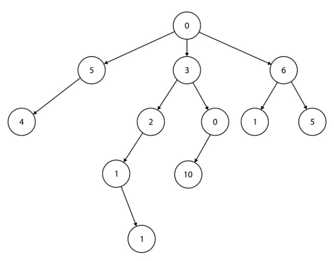
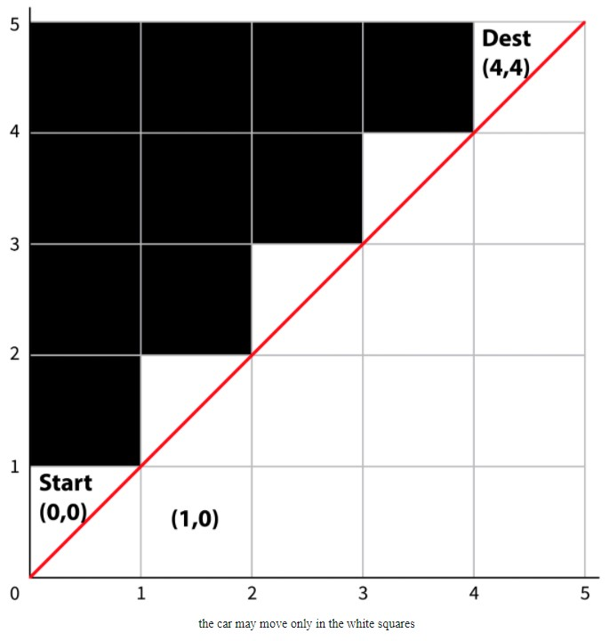

# Coding Questions

### 1. Is Palindrome
Write a function that takes in a string and
returns True if the string is a palindrome
otherwise False.

A palindrome is a string that is written the same
way forward as backwards. Note that single-character
strings are palindromes.

**Sample Input:**
```python
string = 'abcdcba'
```
**Sample Output:**
```python
True
```
**Please follow these steps:**
1. Write your solution in `solutions/is_palindrome.py`
2. Test your solution with `./AlgoShell.sh IsPalindrome`

---

### 2. Bracket Match
A string of brackets is considered correctly matched if 
every opening bracket in the string can be paired up with 
a later closing bracket, and vice versa. For instance, “(())()” 
is correctly matched, whereas “)(“ and “((” aren’t. For 
instance, “((” could become correctly matched by adding 
two closing brackets at the end, so you’d return 2.

Given a string that consists of brackets, write a function 
bracket_match that takes a bracket string as an input and 
returns the minimum number of brackets you’d need to 
add to the input in order to make it correctly matched.

**Sample Input:**
```python
text = '(()'
```
**Sample Output:**
```python
1
```
**Sample Input:**
```python
text = '(())'
```
**Sample Output:**
```python
0
```
**Sample Input:**
```python
text = '())('
```
**Sample Output:**
```python
2
```
**Please follow these steps:**
1. Write your solution in `solutions/bracket_match.py`
2. Test your solution with `./AlgoShell.sh BracketMatch`

---

### 3. Sentence Reverse
You are given an array of characters arr that consists of sequences of characters separated by space characters. Each space-delimited sequence of characters defines a word.

Implement a function reverseWords that reverses the order of the words in the array in the most efficient manner.

**Sample Input:**
```python
arr = [ 'p', 'e', 'r', 'f', 'e', 'c', 't', '  ',
        'm', 'a', 'k', 'e', 's', '  ',
        'p', 'r', 'a', 'c', 't', 'i', 'c', 'e' ]
```
**Sample Output:**
```python
[ 'p', 'r', 'a', 'c', 't', 'i', 'c', 'e', '  ',
  'm', 'a', 'k', 'e', 's', '  ',
  'p', 'e', 'r', 'f', 'e', 'c', 't' ]
```
**Please follow these steps:**
1. Write your solution in `solutions/sentence_reverse.py`
2. Test your solution with `./AlgoShell.sh SentenceReverse`

---

### 4. Pancake Sort
1\) Write a function flip(arr, k) that reverses the order of the first k elements in the array arr.

2\) Write a function pancake_sort(arr) that sorts and returns the input array. You are allowed to use only the function flip you wrote in the first step in order to make changes in the array.

**Sample Input:**
```python
arr = [1, 5, 4, 3, 2]
```
**Sample Output:**
```python
[1, 2, 3, 4, 5]
```
**Please follow these steps:**
1. Write your solution in `solutions/pancake_sort.py`
2. Test your solution with `./AlgoShell.sh PancakeSort`

---

### 5. Array of Array Products
Given an array of integers arr, you’re asked to calculate for each index i the product of all integers except the integer at that index (i.e. except arr[i]). Implement a function arrayOfArrayProducts that takes an array of integers and returns an array of the products.

Solve without using division.

**Sample Input:**
```python
input: arr = [8, 10, 2]
```
**Sample Output:**
```python
output: [20, 16, 80]
# by calculating: [102, 82, 8*10]
```

**Sample Input:**
```python
input: arr = [2, 7, 3, 4]
```
**Sample Output:**
```python
output: [84, 24, 56, 42]
# by calculating: [734, 234, 274, 273]
```

**Please follow these steps:**
1. Write your solution in `solutions/array_of_array_products.py`
2. Test your solution with `./AlgoShell.sh ArrayOfArrayProducts`

---

### 6. Sales Path
The car manufacturer Honda holds their distribution system in the form of a tree (not necessarily binary). The root is the company itself, and every node in the tree represents a car distributor that receives cars from the parent node and ships them to its children nodes. The leaf nodes are car dealerships that sell cars direct to consumers. In addition, every node holds an integer that is the cost of shipping a car to it.

Take for example the tree below:



A path from Honda’s factory to a car dealership, which is a path from the root to a leaf in the tree, is called a Sales Path. The cost of a Sales Path is the sum of the costs for every node in the path. For example, in the tree above one Sales Path is 0→3→0→10, and its cost is 13 (0+3+0+10).

Honda wishes to find the minimal Sales Path cost in its distribution tree. Given a node rootNode, write a function get_cheapest_cost that calculates the minimal Sales Path cost in the tree.

**Sample Input:**
```
Given the rootNode of the tree in diagram above
```
**Sample Output:**
```
7
```
**Explanation**
```
Since it’s the minimal Sales Path cost (there are actually two Sales Paths in the tree whose cost is 7: 0→6→1 and 0→3→2→1→1)
```

**Please follow these steps:**
1. Write your solution in `solutions/sales_path.py`
2. Test your solution with `./AlgoShell.sh SalesPath`

---

### 7. Absolute Value Sort
Given an array of integers arr, write a function abs_sort(arr), that sorts the array according to the absolute values of the numbers in arr. If two numbers have the same absolute value, sort them according to sign, where the negative numbers come before the positive numbers.

**Sample Input:**
```python
arr = [2, -7, -2, -2, 0]
```
**Sample Output:**
```python
[0, -2, -2, 2, -7]
```
**Please follow these steps:**
1. Write your solution in `solutions/absolute_value_sort.py`
2. Test your solution with `./AlgoShell.sh AbsoluteValueSort`

---

### 8. Number of Paths
You’re testing a new driverless car that is located at the Southwest (bottom-left) corner of an n×n grid. The car is supposed to get to the opposite, Northeast (top-right), corner of the grid. Given n, the size of the grid’s axes, write a function num_of_paths_to_dest(n) that returns the number of the possible paths the driverless car can take.



For convenience, let’s represent every square in the grid as a pair (i,j). The first coordinate in the pair denotes the east-to-west axis, and the second coordinate denotes the south-to-north axis. The initial state of the car is (0,0), and the destination is (n-1,n-1).

The car must abide by the following two rules: it cannot cross the diagonal border. In other words, in every step the position (i,j) needs to maintain i >= j. See the illustration above for n = 5. In every step, it may go one square North (up), or one square East (right), but not both. E.g. if the car is at (3,1), it may go to (3,2) or (4,1).

Explain the correctness of your function, and analyze its time and space complexities.

**Sample Input:**
```python
n = 4
```
**Sample Output:**
```python
5
```
**Explanation**
```
since there are five possibilities:

“EEENNN”, “EENENN”, “ENEENN”, “ENENEN”, “EENNEN”

where the 'E' character stands for moving one step
East, and the 'N' character stands for moving one step North.

So, for instance, the path sequence

“EEENNN”

stands for the following steps that the car took:
East, East, East, North, North, North.
```
**Please follow these steps:**
1. Write your solution in `solutions/number_of_paths.py`
2. Test your solution with `./AlgoShell.sh NumberOfPaths`
